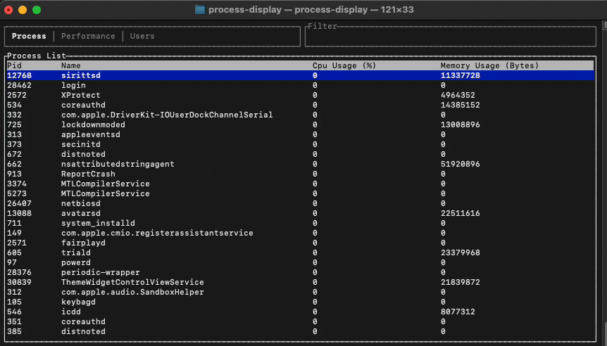

## Example

## Keymap

| Key | Description |
|-----|-------------|
|<kbd>w</kbd>, <kbd>s</kbd>, <kbd>W</kbd>, <kbd>S</kbd> | Move selection up/down/top/bottom
|<kbd>a</kbd>, <kbd>d</kbd> | Move tab left/right
|<kbd>f</kbd> | Follow selection
|<kbd>C</kbd>, <kbd>c</kbd> | Sort by cpu usage dec/inc
|<kbd>M</kbd>, <kbd>m</kbd> | Sort by memory usage dec/inc
|<kbd>P</kbd>, <kbd>p</kbd> | Sort by pid dec/inc
|<kbd>N</kbd>, <kbd>n</kbd> | Sort by name dec/inc
|<kbd>/</kbd>,  <kbd>Enter</kbd>| Filter/Submit filter
|<kbd>?</kbd>, <kbd>Esc</kbd> | Help/Exit